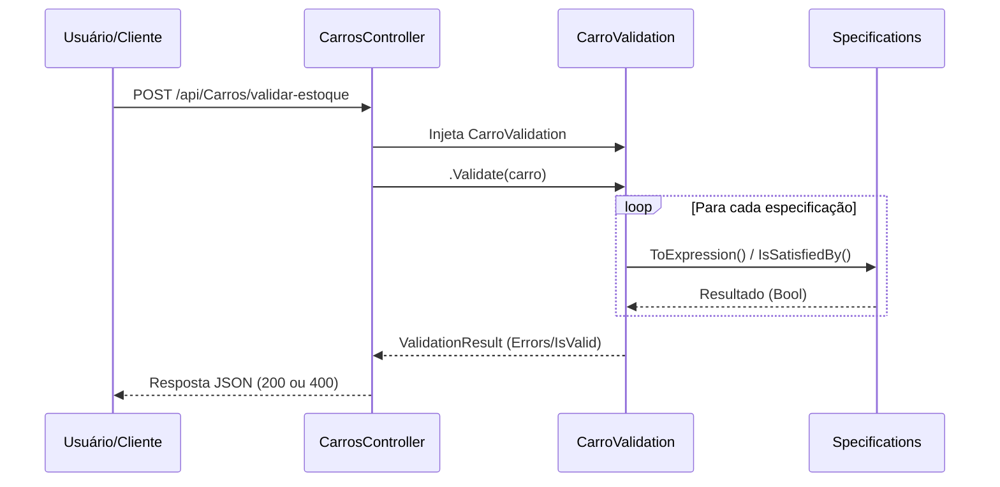

# Estoque API - Design Pattern Specification

Esta API foi desenvolvida em **.NET 8** para demonstrar a implementação profissional do **Specification Pattern**, utilizando a biblioteca `NetDevPack`. O foco é o desacoplamento de regras de negócio complexas da camada de infraestrutura.

## 🧠 O que é o Specification Pattern?

O **Specification Pattern** é um padrão de projeto comportamental onde as regras de negócio são encapsuladas em classes individuais. 

### Vantagens:
- **Reutilização**: Uma regra (ex: `CarroDeLuxoSpec`) pode ser usada em validações, filtros de banco de dados ou seleções em memória.
- **Testabilidade**: É possível criar testes unitários para cada regra isoladamente.
- **Composição**: Regras podem ser combinadas usando operadores lógicos (AND, OR, NOT).
- **Legibilidade**: O código reflete a linguagem ubíqua do negócio.

## 🛠 Tecnologias Utilizadas

- **C# / .NET 8**
- **ASP.NET Core Web API**
- **NetDevPack**: Framework para auxiliar na implementação de conceitos de DDD e Specification.
- **Swagger**: Documentação interativa.

## 📌 Estrutura do Projeto

O projeto segue uma estrutura baseada em Domain-Driven Design (DDD):

- **`RunSpecification/Controllers`**: Camada de entrada que recebe as requisições e retorna os status HTTP.
- **`RunSpecification.Domain/Entities`**: Objetos de valor e entidades (ex: `Carro`).
- **`RunSpecification.Domain/Specs`**: Onde a lógica reside. Cada classe herda de `Specification<T>` e define uma regra única.
- **`RunSpecification.Domain/Validations`**: O `SpecValidator` agrupa as `Specs` e define as mensagens de erro amigáveis.

## 🔄 Fluxo de Validação (Sequence Diagram)



## � Como Executar

1. Certifique-se de ter o **SDK do .NET 8** instalado.
2. Clone o repositório.
3. Navegue até a pasta raiz do projeto via terminal.
4. Execute o comando:
   ```bash
   dotnet run
   ```
5. Acesse o Swagger para testar os endpoints: `https://localhost:7193/swagger/index.html` (a porta pode variar conforme sua configuração).

## 🔌 Endpoints

### Validar Entrada de Estoque.
`POST /api/Carros/validar-estoque`

Valida se um veículo atende aos requisitos para entrar no inventário de luxo.

**Exemplo de Payload:**
```json
{
  "anoModelo": 2026,
  "modelo": "Modelo",
  "cor": 1,
  "carroceria": 1
}
```

## 👨‍💻 Autor

- **Renato Souza** - renatozz@gmail.com
- Website: Escola Dev