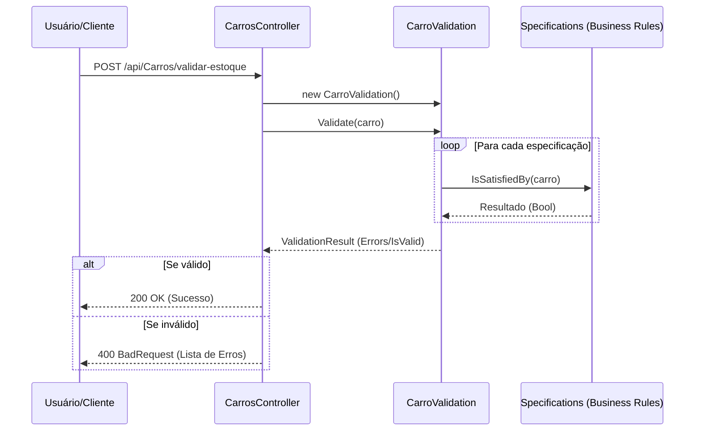

# Estoque API - Design Pattern Specification

Este projeto é uma API de exemplo desenvolvida em .NET 8 para demonstrar a implementação do **Specification Pattern** no contexto de validação de regras de negócio 
para um inventário de veículos de luxo.

## 🚀 Objetivo

O objetivo principal é separar a lógica de negócio (regras de validação) da infraestrutura e dos controladores, permitindo que as regras sejam reutilizáveis, 
testáveis e fáceis de manter através do uso de *Specifications*.

## 🛠 Tecnologias Utilizadas

- **C# / .NET 8**
- **ASP.NET Core Web API**
- **Swagger (Swashbuckle)** para documentação da API
- **Specification Pattern** para encapsulamento de regras de negócio

## 📌 Estrutura do Projeto

- `Controllers/`: Contém o `CarroController`, que recebe as requisições e delega a validação.
- `Domain/Entities/`: Contém a entidade `Carro`.
- `Domain/Validations/`: Contém a classe `CarroValidation` e as implementações das regras de negócio (Specifications).

## 🔄 Fluxo de Validação (Sequence Diagram)

Abaixo está o fluxo de como a requisição é processada utilizando o Specification Pattern:



## � Como Executar

1. Certifique-se de ter o **SDK do .NET 8** instalado.
2. Clone o repositório.
3. Navegue até a pasta raiz do projeto via terminal.
4. Execute o comando:
   ```bash
   dotnet run
   ```
5. Acesse o Swagger para testar os endpoints: `https://localhost:7193/swagger/index.html` (a porta pode variar conforme sua configuração).

## 🔌 Endpoints

### Validar Entrada de Estoque.
`POST /api/Carros/validar-estoque`

Valida se um veículo atende aos requisitos para entrar no inventário de luxo.

**Exemplo de Payload:**
```json
{
  "anoModelo": 2026,
  "modelo": "Modelo",
  "cor": 1,
  "carroceria": 1
}
```

## 👨‍💻 Autor

- **Renato Souza** - renatozz@gmail.com
- Website: Escola Dev